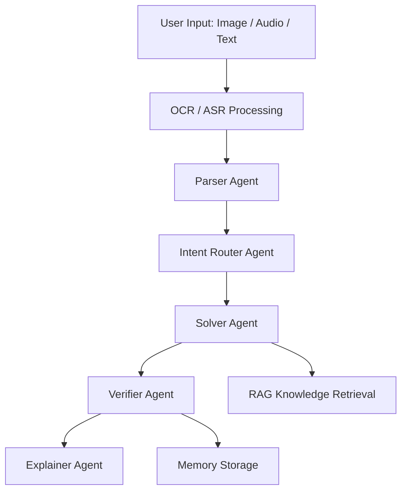

# 🧠 Multimodal Math Mentor  
### Reliable AI System for Solving JEE-Style Math Problems  
*(RAG + Multi-Agent System + HITL + Memory Learning)*

---

## 📌 Project Overview

This project implements a **Multimodal Math Mentor**, an AI application that can reliably solve **JEE-style mathematics problems** and explain solutions **step-by-step**.

The system supports **image, audio, and text inputs**, applies a **multi-agent reasoning pipeline**, verifies correctness, and improves over time using a **memory-based learning system**.

The goal of this project is to demonstrate how **production-grade AI systems** are designed by combining:

- Retrieval-Augmented Generation (RAG)
- Multi-Agent orchestration
- Human-in-the-Loop (HITL)
- Memory-based self-learning
- Multimodal input processing

---

# ✨ Key Features

## 🖼 Multimodal Input

The system accepts three types of inputs:

• **Image input** (textbook or handwritten problems)  
• **Audio input** (spoken math questions)  
• **Text input**

Processing includes:

- OCR extraction for images
- ASR transcription for audio
- Editable preview before solving
- Confidence-based HITL triggers

---

## 🧠 Multi-Agent Architecture

The system is built using specialized AI agents.

| Agent               |              Responsibility                           |
|------ |------       |
| **Parser Agent**    | Cleans OCR/ASR output and structures the math problem |
| **Router Agent**    | Classifies problem type and determines workflow       |
| **Solver Agent**    | Solves the problem using symbolic math tools + RAG    |
| **Verifier Agent**  | Independently validates solution correctness          |
| **Explainer Agent** | Generates step-by-step student-friendly explanations  |

---

## 📚 Retrieval-Augmented Generation (RAG)

A curated knowledge base of math concepts is used to support reasoning.

### RAG Pipeline
```
Knowledge Documents -> Text Chunking -> Embeddings Generation -> Vector Store (FAISS / Chroma) -> Top-K Retrieval
```

Retrieved knowledge chunks are displayed in the UI to maintain **transparency and traceability**.

---

## 👩‍🏫 Human-in-the-Loop (HITL)

Human intervention is triggered when:

- OCR confidence is low
- ASR transcription is unclear
- Parser detects ambiguity
- Verifier confidence is low

Users can:

- Edit extracted text
- Provide clarifications
- Correct answers

These corrections are stored as **learning signals**.

---

## 🧠 Memory & Self-Learning

The system maintains a memory layer storing:

- Original input
- Parsed question
- Retrieved context
- Final answer
- Verifier outcome
- User feedback

Memory is reused during runtime to:

- Detect similar past problems
- Reuse successful reasoning patterns
- Improve reliability over time

---

# 🏗 System Architecture



## 📊 Supported Math Topics

The system currently supports:

Algebra

Probability

Basic Calculus (Limits, Derivatives)

Linear Algebra (basic problems)

## 🖥 Application Interface

The UI includes:

Input mode selector (Text / Image / Audio)

OCR / ASR extraction preview

Editable HITL correction box

Agent trace panel

Retrieved context viewer

Final answer + explanation

Confidence indicator

Feedback system

## 🚀 Deployment

The application is deployed using Streamlit.

Live App: https://kavya-multimodal-math-mentor.streamlit.app/

## ⚙️ Installation & Setup
1️⃣ Clone the repository
git clone https://github.com/yourusername/math-mentor.git
cd math-mentor

2️⃣ Install dependencies
pip install -r requirements.txt

3️⃣ Run the application
streamlit run app.py


## 🎥 Demo Video

The demo video demonstrates:

Image → solution workflow

Audio → solution workflow

Human-in-the-loop correction

Memory reuse on repeated questions

Demo Video Link:


## 📈 Evaluation Summary
| Component           | Status |
|-----------          |--------     |
| Multimodal Input    | Implemented |
| Multi-Agent System  | Implemented |
| RAG Retrieval       | Implemented |
| Human-in-the-Loop   | Implemented |
| Memory Learning     | Implemented |
| Verification System | Implemented |

The system demonstrates a reliable architecture for building AI-driven educational assistants.

## 🧑‍💻 Author

Kavya Onti

Computer Science Engineering Student
AI / ML / Data Science Enthusiast

## 📜 License

This project was developed for the AI Planet AI Engineer Assignment.